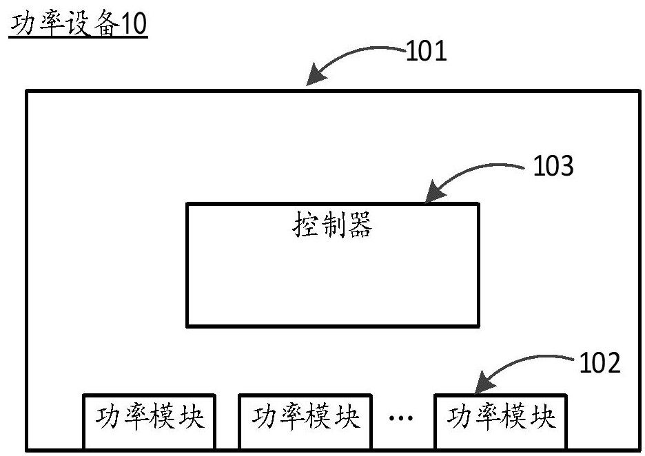
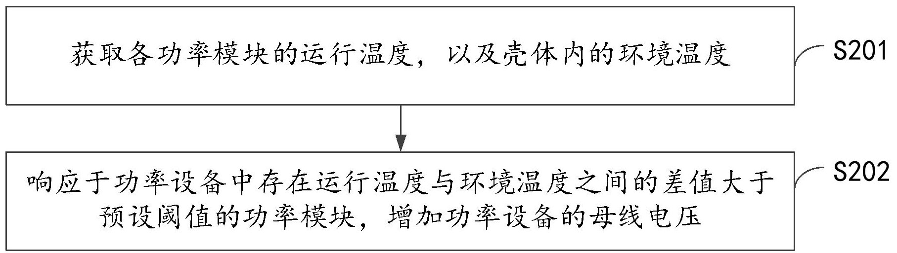
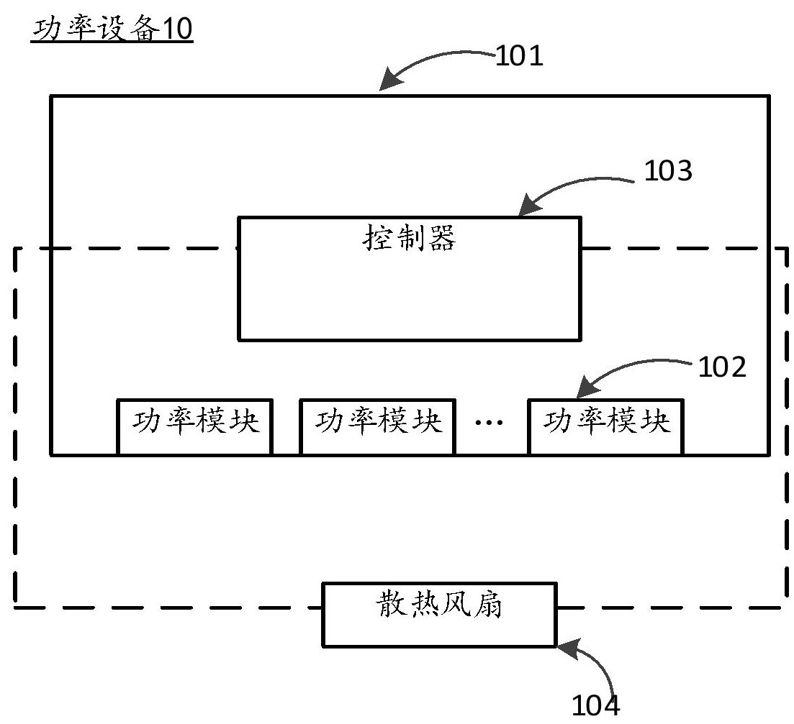

# 功率设备及其控制方法

## 基本信息

| 项目 | 内容 |
|-----|-----|
| 申请公布号 | CN 121984334 A |
| 申请公布日 | 2026.05.05 |
| 申请号 | 202512015595.9 |
| 申请日 | 2025.12.29 |
| 申请人 | 阳光电源股份有限公司 |
| 地址 | 安徽省合肥市高新区习友路1699号 |
| 发明人 | 李家旺、代尚方 |
| 专利代理机构 | 北京辰权知识产权代理有限公司 11619 |
| 专利代理师 | 谷波 |
| Int.Cl. | H02M 1/32(2007.01)、H05K 7/20(2006.01) |

---

## 摘要

本申请提供一种功率设备及其控制方法，涉及电力电子技术领域，功率设备包括壳体以及设置在所述壳体内的至少一个功率模块，所述方法包括：获取各功率模块的运行温度，以及所述壳体内的环境温度；响应于所述功率设备中存在所述运行温度与所述环境温度之间差值大于预设阈值的功率模块，增加所述功率设备的母线电压。本申请能够解决现有功率模块出现凝露的问题。

---

## 权利要求书

**权利要求 1**

一种功率设备的控制方法，其特征在于，所述功率设备包括壳体以及设置在所述壳体内的至少一个功率模块，所述方法包括：

- 获取各功率模块的运行温度，以及所述壳体内的环境温度；
- 响应于所述功率设备中存在所述运行温度与所述环境温度之间的差值大于预设阈值的功率模块，增加所述功率设备的母线电压。

**权利要求 2**

根据权利要求1所述的方法，其特征在于，响应于所述功率设备中存在所述运行温度与所述环境温度之间的差值大于预设阈值的功率模块，增加所述功率设备的母线电压，包括：

将所述母线电压增加至目标电压，所述目标电压根据所述母线电压下限值与预设参数得到。

**权利要求 3**

根据权利要求2所述的方法，其特征在于，所述预设参数与所述差值具有映射关系，将所述母线电压增加至目标电压，包括：

- 根据所述差值和预设的温差-参数匹配关系，确定与所述差值对应的目标参数；
- 根据所述目标参数和所述母线电压下限值，确定所述目标电压；
- 将所述母线电压增加至所述目标电压。

**权利要求 4**

根据权利要求2所述的方法，其特征在于，响应于所述功率设备中存在所述运行温度与所述环境温度之间的差值大于预设阈值的功率模块，增加所述功率设备的母线电压，包括：

根据各功率模块的运行温度与所述环境温度之间的差值，调节所述功率设备的母线电压，直至所述功率设备中所有功率模块的运行温度与所述环境温度之间差值均小于或等于预设阈值，所述目标电压的调节量与所述差值呈正相关。

**权利要求 5**

根据权利要求4所述的方法，其特征在于，根据各功率模块的运行温度与所述环境温度之间的差值，增加所述功率设备的母线电压，包括：

在每一温度采样周期内，按照预设增量逐级增加所述功率设备的母线电压，直至所述功率设备中所有功率模块的运行温度与所述环境温度之间差值均小于或等于预设阈值。

**权利要求 6**

根据权利要求1-5任一项所述的方法，其特征在于，所述功率设备还包括散热风扇，所述散热风扇用于为所述功率模块散热，所述方法还包括：

响应于所述功率设备中存在所述运行温度与所述环境温度之间差值大于预设阈值的功率模块，降低所述散热风扇的转速。

**权利要求 7**

根据权利要求6所述的方法，其特征在于，响应于所述功率设备中存在所述运行温度与所述环境温度之间差值大于预设阈值的功率模块，降低所述散热风扇的转速，包括：

- 基于所述功率模块的运行温度和温度-转速映射关系，确定所述散热风扇的目标转速；
- 根据所述目标转速，降低所述散热风扇的转速。

**权利要求 8**

根据权利要求6所述的方法，其特征在于，所述方法包括：

- 响应于所述功率设备中存在所述运行温度与所述环境温度之间的差值大于预设阈值的功率模块，且所述差值大于第一温差，增加所述功率设备的母线电压；
- 以及，在所述差值大于第二温差的情况下，降低所述散热风扇的转速，所述第二温差大于所述第一温差。

**权利要求 9**

一种功率设备，其特征在于，包括：控制器、壳体以及设置在所述壳体内的至少一个功率模块，所述控制器与所述至少一个功率模块耦接；

所述控制器用于获取各功率模块的运行温度，以及所述壳体内的环境温度；响应于所述功率设备中存在所述运行温度与所述环境温度之间的差值大于预设阈值的功率模块，增加所述功率设备的母线电压。

**权利要求 10**

如权利要求9所述的功率设备，其特征在于，所述功率设备还包括散热风扇，所述控制器与所述散热风扇耦接；

所述控制器还用于响应于所述功率设备中存在所述运行温度与所述环境温度之间差值大于预设阈值的功率模块，降低所述散热风扇的转速。

**权利要求 11**

如权利要求9或10所述的功率设备，其特征在于，所述功率设备还包括：分别与所述控制器连接的第一温度采集装置和第二温度采集装置；

- 所述第一温度采集装置设置于各功率模块内，用于获取各功率模块的运行温度；
- 所述第二温度采集装置设置于所述功率设备的壳体内，用于获取所述壳体内的环境温度。

---

## 说明书

### 技术领域

[0001] 本申请涉及电力电子技术领域，特别是涉及一种功率设备及其控制方法。

### 背景技术

[0002] 逆变器等功率设备在高温高湿等地区运行时，功率设备内仓温度较高，而功率设备中的某些功率模块可能会存在发热量小的情况，导致某些功率模块自身温度低于环境温度而产生凝露，凝露会导致电气绝缘下降，可能引起短路，最终导致功率设备内开关管等器件失效。

### 发明内容

[0003] 有鉴于此，本申请的目的在于提出一种功率设备及其控制方法，本申请能够针对性的解决现有功率模块出现凝露的问题。

[0004] 基于上述目的，第一方面，本申请提出了一种功率设备的控制方法，所述功率设备包括壳体以及设置在所述壳体内的至少一个功率模块，所述方法包括：获取各功率模块的运行温度，以及所述壳体内的环境温度；响应于所述功率设备中存在所述运行温度与所述环境温度之间差值大于预设阈值的功率模块，增加所述功率设备的母线电压。

[0005] 在一些实施例中，所述响应于所述功率设备中存在所述运行温度与所述环境温度之间的差值大于预设阈值的功率模块，增加所述功率设备的母线电压，包括：将所述母线电压增加至目标电压，所述目标电压根据所述母线电压下限值与预设参数得到。

[0006] 在一些实施例中，所述预设参数与所述差值具有映射关系，将所述母线电压增加至目标电压，包括：根据所述差值和预设的温差-参数匹配关系，确定与所述差值对应的目标参数；根据所述目标参数和所述母线电压下限值，确定所述目标电压；将所述母线电压增加至所述目标电压。

[0007] 在一些实施例中，所述响应于所述功率设备中存在所述运行温度与所述环境温度之间的差值大于预设阈值的功率模块，增加所述功率设备的母线电压，包括：根据各功率模块的运行温度与所述环境温度之间的差值，调节所述功率设备的母线电压，直至所述功率设备中所有功率模块的运行温度与所述环境温度之间差值均小于或等于预设阈值，所述目标电压的调节量与所述差值呈正相关。

[0008] 在一些实施例中，所述根据各功率模块的运行温度与所述环境温度之间的差值，增加所述功率设备的母线电压，包括：在每一温度采样周期内，按照预设增量逐级增加所述功率设备的母线电压，直至所述功率设备中所有功率模块的运行温度与所述环境温度之间差值均小于或等于预设阈值，得到所述目标电压。

[0009] 在一些实施例中，所述功率设备还包括散热风扇，所述散热风扇用于为所述功率模块散热，所述方法还包括：响应于所述功率设备中存在所述运行温度与所述环境温度之间差值大于预设阈值的功率模块，降低与所述功率模块对应的散热风扇的转速。

[0010] 在一些实施例中，所述响应于所述功率设备中存在所述运行温度与所述环境温度之间差值大于预设阈值的功率模块，降低与所述功率模块对应的散热风扇的转速，包括：基于所述功率模块的运行温度和温度-转速映射关系，确定所述散热风扇的目标转速；根据所述目标转速，降低所述散热风扇的转速。

[0011] 在一些实施例中，响应于所述功率设备中存在所述运行温度与所述环境温度之间的差值大于预设阈值的功率模块，且所述差值大于第一温差小于或等于第二温差，增加所述功率设备的母线电压；以及，在所述差值大于所述第二温差的情况下，降低所述散热风扇的转速，所述第二温差大于所述第一温差。

[0012] 第二方面，还提供了一种功率设备，包括：控制器、壳体以及设置在所述壳体内的至少一个功率模块，所述控制器与所述至少一个功率模块耦接；所述控制器用于获取各功率模块的运行温度，以及所述壳体内的环境温度；响应于所述功率设备中存在所述运行温度与所述环境温度之间差值大于预设阈值的功率模块，增加所述功率设备的母线电压。

[0013] 在一些实施例中，所述功率设备还包括散热风扇，所述控制器与所述散热风扇耦接；所述控制器还用于响应于所述功率设备中存在所述运行温度与所述环境温度之间的差值大于预设阈值的功率模块，降低与所述功率模块对应的散热风扇的转速。

[0014] 在一些实施例中，所述功率设备还包括：分别与所述控制器连接的第一温度采集装置和第二温度采集装置；所述第一温度采集装置设置于各功率模块内，用于获取各功率模块的运行温度；所述第二温度采集装置设置于所述功率设备的壳体内，用于获取所述壳体内的环境温度。

[0015] 总的来说，本申请至少存在以下有益效果：

本实施例当功率模块的运行温度与环境温度之间的差值大于预设阈值时，增加功率设备的母线电压，可以使得功率模块的功率提升，产热增加，进而提升功率模块的温度，功率模块温度升高后，其与环境的温差减小，从而低于凝露产生的临界条件，不需要增加电路元器件和电路，简单可靠即可达到防止凝露的效果。

[0016] 上述说明仅是本申请技术方案的概述，为了能够更清楚了解本申请的技术手段，而可依照说明书的内容予以实施，并且为了让本申请的上述和其它目的、特征和优点能够更明显易懂，以下特举本申请的具体实施方式。

### 附图说明

[0017] 在附图中，除非另外规定，否则贯穿多个附图相同的附图标记表示相同或相似的部件或元素。这些附图不一定是按照比例绘制的。应该理解，这些附图仅描绘了根据本申请公开的一些实施方式，而不应将其视为是对本申请范围的限制。而且在全部附图中，用相同的附图标号表示相同的部件。

[0018] 图1示出本申请实施例提供的功率设备的一种结构示意图；

图2示出本申请实施例提供一种功率设备的控制方法的步骤流程图；

图3示出本申请实施例提供的功率设备的另一种结构示意图。

### 具体实施方式

[0019] 下面将结合附图对本申请技术方案的实施例进行详细的描述。以下实施例仅用于更加清楚地说明本申请的技术方案，因此只作为示例，而不能以此来限制本申请的保护范围。

[0020] 除非另有定义，本文所使用的所有的技术和科学术语与属于本申请的技术领域的技术人员通常理解的含义相同；本文中所使用的术语只是为了描述具体的实施例的目的，不是旨在于限制本申请；本申请的说明书和权利要求书及上述附图说明中的术语"包括"和"具有"以及它们的任何变形，意图在于覆盖非排他的包含。

[0021] 在本申请实施例的描述中，技术术语"第一""第二"等仅用于区别不同对象，而不能理解为指示或暗示相对重要性或者隐含指明所指示的技术特征的数量、特定顺序或主次关系。在本申请实施例的描述中，"多个"的含义是两个以上，除非另有明确具体的限定。

[0022] 在本文中提及"实施例"意味着，结合实施例描述的特定特征、结构或特性可以包含在本申请的至少一个实施例中。在说明书中的各个位置出现该短语并不一定均是指相同的实施例，也不是与其它实施例互斥的独立的或备选的实施例。本领域技术人员显式地和隐式地理解的是，本文所描述的实施例可以与其它实施例相结合。

[0023] 在本申请实施例的描述中，术语"和/或"仅仅是一种描述关联对象的关联关系，表示可以存在三种关系，例如A和/或B，可以表示：单独存在A，同时存在A和B，单独存在B这三种情况。另外，本文中字符"/"，一般表示前后关联对象是一种"或"的关系。

[0024] 在本申请实施例的描述中，术语"多个"指的是两个以上（包括两个），同理，"多组"指的是两组以上（包括两组），"多片"指的是两片以上（包括两片）。

[0025] 在本申请实施例的描述中，除非另有明确的规定和限定，技术术语"安装""相连""连接""固定"等术语应做广义理解，例如，可以是固定连接，也可以是可拆卸连接，或成一体；也可以是机械连接，也可以是电连接；可以是直接相连，也可以通过中间媒介间接相连，可以是两个元件内部的连通或两个元件的相互作用关系。对于本领域的普通技术人员而言，可以根据具体情况理解上述术语在本申请实施例中的具体含义。

[0026] 在本文中使用术语"耦合"、"耦接"和"连接"来指代在两个对象之间的直接或间接连接。例如，当描述第一对象耦合到第二对象时，即使第一对象未与第二对象直接物理地接触，而是通过导体和/或其他对象与第二对象间接接触，第一对象依然被认为可以耦合到第二对象。术语"电路"被广泛地使用并且旨在同时包括电子元件和导体的硬件具体实施，这些电子元件和导体在被连接和配置时，使得能够执行本申请中描述的功能，而不受电子电路类型的限制。

[0027] 需要说明的是，在不冲突的情况下，本申请中的实施例及实施例中的特征可以相互组合。下面将参考附图并结合实施例来详细说明本申请。

[0028] 图1示出本申请实施例提供的功率设备的一种结构示意图，如图1所示，功率设备包括壳体以及设置在壳体内的至少一个功率模块，功率设备例如是逆变器，功率模块可以是一个或者多个逆变单元、DCDC单元。详细的，DCDC单元可以是boost电路、buckboost电路等，逆变单元可以是两电平逆变拓扑、T型NPC三电平、I型NPC三电平、ANPC等拓扑以及多电平拓扑等电力电子模块。

[0029] 本实施例中，功率设备内还设置有控制器，控制器与各功率模块耦接，用于控制各功率模块的运行。功率设备内部还可以设置温度采集装置来采集各功率模块的运行温度，以及壳体内的环境温度。温度采集装置与控制器耦接，以将各功率模块的运行温度和壳体内的环境温度输出至控制器，以使控制器执行本实施例提出的功率设备的控制方法。

[0030] 图2示出本申请实施例提供一种功率设备的控制方法的步骤流程图，如图2所示，功率设备的控制方法包括S201~S202：

**S201**、获取各功率模块的运行温度，以及壳体内的环境温度；

**S202**、响应于功率设备中存在运行温度与环境温度之间的差值大于预设阈值的功率模块，增加功率设备的母线电压。

[0031] 本申请实施例的执行主体可以为能够执行功率设备的控制方法的电子设备，该电子设备包括上述功率设备的控制器。

[0032] 在一些例子中，可以通过设置在功率设备内部的温度采集装置来采集各功率模块的运行温度，以及壳体内的环境温度。控制器获取各功率模块的运行温度，以及壳体内的环境温度，并将各功率模块的运行温度与壳体内的环境温度进行比较计算，得到各功率模块的运行温度与环境温度之间的差值。

[0033] 本实施例中，功率设备的母线电压由功率设备的母线连接的电压源提供，母线电压例如由光伏组件、电池等电源提供或通过整流产生。

[0034] 在运行温度与环境温度之间的差值大于预设阈值的功率模块的情况下，表明功率模块的温度较低，而环境温度较高，功率模块的温度可能低于露点温度，此时若湿度较高，功率模块就可能发生凝露，因此，需要采取措施来防止凝露。

[0035] 本实施例当功率模块的运行温度与环境温度之间的差值大于预设阈值时，增加功率设备的母线电压，可以使得功率模块的功率提升，产热增加，进而提升功率模块的温度，功率模块温度升高后，其与环境的温差减小，从而低于凝露产生的临界条件，不需要增加电路元器件和电路，简单可靠即可达到防止凝露的效果。

[0036] 本申请实施例中，步骤S202响应于功率设备中存在运行温度与环境温度之间的差值大于预设阈值的功率模块，增加功率设备的母线电压，包括：将母线电压增加至目标电压，目标电压根据母线电压下限值与预设参数得到。

[0037] 在一些例子中，目标电压在功率设备的母线电压下限值与母线电压上限值之间。功率设备的母线电压下限值可根据维持并网所需的最低电压确定，即并网门槛电压，指的是并网逆变器能够正常、稳定地将直流电转换为交流电并馈入公共电网时，其内部直流母线所必须达到的最低电压值。

[0038] 在一些例子中，功率设备的母线电压上限值可根据功率模块中元器件耐压等级、功率设备的最大承受电压等因素确定，具体的数值可根据实际需求设置。

[0039] 本实施例将母线电压增加至目标电压，但控制目标电压在功率设备的母线电压下限值与母线电压上限值之间，即，将电压提升目标限定在安全窗口内，可以防止因电压过高损坏设备或因电压过低导致系统脱离正常运行状态，在解决凝露问题的同时，保证了设备本身的安全稳定运行。

[0040] 本申请实施例的预设参数可以包括预设值，例如，目标电压 = 母线电压下限值 + 预设值，预设值是预设的、固定的电压偏移量，可根据实验和经验设定，例如预设值为50V。

[0041] 在一些例子中，预设值可以根据不同型号逆变器的散热能力、应用地域的气候特点进行灵活调整。例如，在极度潮湿的地区，可以将预设值设置为60V。

[0042] 在存在运行温度与环境温度之间差值大于预设阈值的功率模块的情况下，直接将母线电压提升至第一目标电压，一方面，目标电压是基于母线电压下限值计算的，使得提升后的电压满足并网要求，不会因电压过高或过低而引发系统故障；另一方面，直接通过固定的目标电压值控制母线电压，无需复杂的实时计算，有利于快速抑制凝露。

[0043] 本申请实施例的预设参数也可以是预设系数，将母线电压增加至目标电压，例如，目标电压 = 母线电压下限值 ×（1+预设系数），例如，预设系数为10%，也就是说，在母线电压下限值的基础上，将电压提升10%。

[0044] 在电力电子系统中，很多控制特性（如调制比）是相对于母线电压的比值而言的。因此，本实施例采用比例控制的方法能在提升电压的同时，适应不同电网规格，提高控制精度。

[0045] 本申请实施例中，预设参数与差值具有映射关系，将母线电压增加至目标电压，包括：根据差值和预设的温差-参数匹配关系，确定与差值对应的目标参数；根据目标参数和母线电压下限值，确定目标电压；将母线电压增加至目标电压。

[0046] 在一些例子中，温差-参数匹配关系指的是预先设定在功率设备的控制器中的参数选取规则，温差-参数匹配关系能够表征温差和预设参数之间的对应关系，例如，当温度差值为5度时，对应第一预设参数，当温度差值为10度时，对应第二预设参数。也可以是当温差小于5度时，对应第一预设参数，当温度差值大于5度但小于10度时，对应第二预设参数。

[0047] 例如，当温度差值为5度时，对应第一预设参数，则目标参数为第一预设参数，进而根据第一预设参数和母线电压下限值，来得到与温差5度对应的目标电压，将母线电压增加至目标电压。

[0048] 又例如，当温度差值为10度时，对应第二预设参数，则目标参数为第二预设参数，进而根据第二预设参数和母线电压下限值，来得到与温差10度对应的目标电压，将母线电压增加至目标电压。

[0049] 需要说明的是，运行温度与所述环境温度之间的差值越大，则说明需要的热量越高，则需要的母线电压也越高，因此，预设参数与温差呈正相关，即，温差越大，对应的预设参数也越大。

[0050] 上述实施例，为不同的温差匹配不同的预设参数，可实现母线电压随温差的变化而逐级递增，提高温度控制的精度。

[0051] 本申请实施例中，响应于功率设备中存在运行温度与环境温度之间的差值大于预设阈值的功率模块，增加功率设备的母线电压，包括：根据各功率模块的运行温度与环境温度之间的差值，调节功率设备的母线电压，直至功率设备中所有功率模块的运行温度与环境温度之间差值均小于或等于预设阈值，目标电压的调节量与差值呈正相关。

[0052] 本实施例在检测到存在运行温度与环境温度之间差值大于预设阈值的功率模块，增加母线电压后，持续获取各功率模块的运行温度与环境温度，且进行比较，根据实时的温差反馈，持续地、动态地调整目标电压，直到所有功率模块的运行温度与环境温度之间差值均小于或等于预设阈值，进而实现功率模块的运行温度与环境温度之间差值的闭环控制。

[0053] 其中，当存在运行温度与环境温度之间差值大于预设阈值的功率模块时，增加母线电压，以使功率模块的产热增加，进而提升功率模块的温度，防止凝露。

[0054] 在一些例子中，调节母线电压至目标电压时，对目标电压的调节量与差值呈正相关，也就是说，目标电压的调节量随着差值的增加而增加，当运行温度与环境温度之间差值增加时，增加目标电压的调节量，使得母线电压上升的更多，进而加快温度调节效率。

[0055] 当所有功率模块的运行温度与环境温度之间差值均小于或等于预设阈值时，说明此时各功率模块凝露风险较低，此时可降低母线电压，以减少功率设备能耗。

[0056] 本实施例提供了一种动态闭环控制方法，通过持续的反馈与电压调整，最终得到动态优化的目标电压，提高控制精度，从而在确保防止凝露的同时，避免过度提升电压造成不必要的效率损失，实现效果与能耗的最优平衡。

[0057] 本申请实施例中，根据各功率模块的运行温度与环境温度之间的差值，增加功率设备的母线电压，包括：在每一温度采样周期内，按照预设增量逐级增加功率设备的母线电压，直至功率设备中所有功率模块的运行温度与环境温度之间差值均小于或等于预设阈值，得到目标电压。

[0058] 本实施例中，可通过设置温度采样周期，每隔一个采样周期采集一次温度数据，例如，在第一个采样周期内，检测到某功率模块的运行温度与环境温度之间的差值大于预设阈值，则将母线电压增加预设增量，预设增量例如是5V，母线电压增加之后，功率设备产热增加，在第二个采样周期内，再次采集各功率模块的运行温度与环境温度，检测各功率模块的运行温度与环境温度之间的差值与预设阈值的大小关系，如此循环，直至功率设备中所有功率模块的运行温度与环境温度之间差值均小于或等于预设阈值。

[0059] 本实施例通过设置预设增量，每次仅增加预设增量的母线电压，采用逐级增加的方式，防止电压突变带来的输出波动，防止凝露的同时，保证了整个功率设备运行的稳定性和可靠性。

[0060] 图3示出本申请实施例提供的功率设备的另一种结构示意图，如图3所示，本申请实施例中，功率设备还包括散热风扇，散热风扇可以通过改变转速来改变风量，进而调节功率模块的温度，防止功率模块温度过高。

[0061] 本实施例中，功率设备的控制方法还包括：响应于功率设备中存在运行温度与环境温度之间差值大于预设阈值的功率模块，降低散热风扇的转速。

[0062] 上述实施例中，增加母线电压可以增加功率模块自身产热，在此基础上，本实施例还通过降低散热风扇的转速，来减缓功率模块散热速度，进而减少功率模块的热量散失，进而减小功率模块的运行温度与环境温度的差值，防止凝露的产生。

[0063] 本实施例通过提升电压增加产热，并通过降低风扇转速减少散热，两种温度控制方式相结合，提升模块温度的效果更快，可以更快消除凝露风险。

[0064] 本申请实施例中，响应于功率设备中存在运行温度与环境温度之间差值大于预设阈值的功率模块，降低散热风扇的转速，包括：基于功率变换器的运行温度和温度-转速映射关系，确定散热风扇的目标转速；根据目标转速，降低散热风扇的转速。

[0065] 在一个例子中，温度-转速映射关系指的是预先设定在功率设备的控制器中的一种决策规则或函数关系，温度-转速映射关系可以表征功率设备的热状态与散热风扇目标转速之间的对应关系。功率设备的热状态包括各功率模块的运行温度及其与环境温度的差值。

[0066] 在一些例子中，各功率模块的运行温度及其与环境温度的差值越大，散热风扇的目标转速越小。

[0067] 本实施例中提供预设的温度-转速映射关系来智能确定目标转速，使风扇控制更精确，既能防止温度较低的功率模块凝露，又能防止避免盲目停转导致温度较高的功率模块过热，实现了功率模块的平衡控制。

[0068] 本申请实施例中，功率设备的控制方法包括：响应于功率设备中存在运行温度与环境温度之间差值大于预设阈值的功率模块，且差值大于第一温差，增加功率设备的母线电压；以及，在差值大于第二温差的情况下，降低散热风扇的转速，第二温差大于第一温差。

[0069] 当功率设备中存在运行温度与环境温度之间的差值大于预设阈值的功率模块，且差值大于第一温差时，说明存在轻度凝露风险，此时可通过单独增加功率设备的母线电压来减小运行温度与环境温度之间的差值，实现对功率设备温度的初步调节。

[0070] 当功率设备中存在运行温度与环境温度之间的差值大于第二温差的功率模块时，说明该功率模块凝露风险较高，则在增加功率设备的母线电压的同时，降低散热风扇的转速，采用增加产热和降低散热两种方式并行，可有效避免凝露。

[0071] 在一些例子中，当功率设备中存在运行温度与环境温度之间的差值大于第二温差的功率模块时，停止增加母线电压，降低散热风扇的转速。停止增加母线电压可防止母线电压过高影响其他功率模块正常运行，降低散热风扇的转速可快速调节功率模块的温度，以减小运行温度与环境温度之间的差值。

[0072] 上述实施例根据运行温度与环境温度之间的差值与第一温差和第二温差的关系，动态匹配不同的温度控制策略，可提高温度控制的效率。

[0073] 本实施例提供一种功率设备，如图1所示，功率设备包括：控制器、壳体以及设置在壳体内的至少一个功率模块，控制器与至少一个功率模块耦接，控制器用于获取各功率模块的运行温度，以及壳体内的环境温度；响应于功率设备中存在运行温度与环境温度之间的差值大于预设阈值的功率模块，增加功率设备的母线电压。

[0074] 本实施例中，控制器可以设置在壳体内部，例如控制器是用于控制各功率模块运行的微处理器。

[0075] 在一些例子中，控制器还可以设置在壳体外部，例如控制器是用于控制功率设备的上位机，或者与功率设备进行信息交互的控制单元。

[0076] 本实施例当功率模块的运行温度与环境温度之间的差值大于预设阈值时，增加功率设备的母线电压，可以使得功率模块的功率提升，产热增加，进而提升功率模块的温度，功率模块温度升高后，其与环境的温差减小，从而低于凝露产生的临界条件，达到防止凝露的效果。

[0077] 如图3所示，本实施例中，功率设备还包括散热风扇，控制器与散热风扇耦接；控制器还用于响应于功率设备中存在运行温度与环境温度之间差值大于预设阈值的功率模块，降低散热风扇的转速。

[0078] 本实施例通过提升电压增加产热，并通过降低风扇转速减少散热，两种温度控制方式相结合，提升模块温度的效果更快，可以更快消除凝露风险。

[0079] 本实施例的功率设备还包括：分别与控制器连接的第一温度采集装置和第二温度采集装置；第一温度采集装置设置于各功率模块内，用于获取各功率模块的运行温度；第二温度采集装置设置于功率设备的壳体内，用于获取壳体内的环境温度。

[0080] 第一温度采集装置和第二温度采集装置例如是温度传感器或温湿度传感器，第一温度采集装置设置于各功率模块内，可准确获取各功率模块的运行温度。第二温度采集装置设置于功率设备的壳体内，可准确获取壳体内的环境温度。第一温度采集装置和第二温度采集装置可通过采集电路与控制器连接，也可以通过数字通信协议与控制器进行数据传输。

[0081] 在另一些例子中，第一温度采集装置还可以设置于壳体内且与各功率模块的表面接触，以获取各功率模块表面的温度数据。

[0082] 本申请的上述实施例提供的功率设备与本申请实施例提供的功率设备的控制方法出于相同的申请构思，具有与其所采用、运行或实现的方法相同的有益效果。

[0083] 上述的控制器可以是通用处理器，包括中央处理器（Central Processing Unit，简称CPU）、网络处理器（Network Processor，简称NP）等；还可以是数字信号处理器（DSP）、专用集成电路（ASIC）、现成可编程门阵列（FPGA）或者其他可编程逻辑器件、分立门或者晶体管逻辑器件、分立硬件组件。可以实现或者执行本申请实施例中的公开的各方法、步骤及逻辑框图。通用处理器可以是微处理器或者该处理器也可以是任何常规的处理器等。结合本申请实施例所公开的方法的步骤可以直接体现为硬件译码处理器执行完成，或者用译码处理器中的硬件及软件模块组合执行完成。软件模块可以位于随机存储器，闪存、只读存储器，可编程只读存储器或者电可擦写可编程存储器、寄存器等本领域成熟的存储介质中。

[0084] 需要说明的是：

在上述文本中，术语"包括"、"包含"或者其任何其他变体意在涵盖非排他性的包含，从而使得包括一系列要素的过程、方法、物品或者装置不仅包括那些要素，而且还包括没有明确列出的其他要素，或者是还包括为这种过程、方法、物品或者装置所固有的要素。在没有更多限制的情况下，由语句"包括一个……"限定的要素，并不排除在包括该要素的过程、方法、物品或者装置中还存在另外的相同要素。此外，需要指出的是，本申请实施方式中的方法和装置的范围不限按示出或讨论的顺序来执行功能，还可包括根据所涉及的功能按基本同时的方式或按相反的顺序来执行功能，例如，可以按不同于所描述的次序来执行所描述的方法，并且还可以添加、省去、或组合各种步骤。另外，参照某些示例所描述的特征可在其他示例中被组合。

[0085] 通过以上的实施方式的描述，本领域的技术人员可以清楚地了解到上述实施例方法可借助软件加必需的通用硬件平台的方式来实现，当然也可以通过硬件，但很多情况下前者是更佳的实施方式。基于这样的理解，本申请的技术方案本质上或者说对现有技术做出贡献的部分可以以软件产品的形式体现出来，该计算机软件产品存储在一个存储介质（如ROM/RAM、磁碟、光盘）中，包括若干指令用以使得一台终端（可以是手机，计算机，服务器，空调器，或者网络设备等）执行本申请各个实施例所述的方法。

[0086] 上面结合附图对本申请的实施例进行了描述，仅为本申请的具体实施方式，但是本申请并不局限于上述的具体实施方式，上述的具体实施方式仅仅是示意性的，而不是限制性的，本领域的普通技术人员在本申请的启示下，在不脱离本申请宗旨和权利要求所保护的范围情况下，还可做出很多形式，均属于本申请的保护之内。

---

## 附图

### 图1 功率设备的一种结构示意图

### 图2 功率设备的控制方法的步骤流程图

### 图3 功率设备的另一种结构示意图

